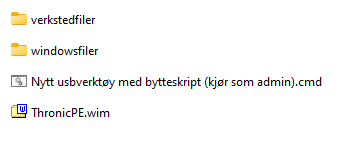

## USB verktøy

 

Et skript jeg skrev og bruker for opprettelse av USB verktøy.  
Skriptet oppretter ny stikke med 10GB for boot og resten til verkstedfiler (diverse).  

Først laster man ned Windows via media creation tool eller rufus og oppretter  
ei stikke med tweaks fra rufus. Deretter kopierer man alt på den stikka til  
mappen windowsfiler. Kopier eksisterende verkstedfiler også til verkstedfiler  
mappen dersom du har eksisterende verktøy eller filer du vil ha overført til  
ny brikke.  

Ta ut og inn USB brikken, eller sett i en annen du vil bruke som verktøy.  
Kjør skriptet som administrator og følg de enkle stegene (forsiktig på steg 1).  

ThronicPE.wim kan være hvilken som helst boot.wim/WinRE du har laget selv.  
Jeg bruker min egen som jeg har bygget med Win10XPE og oppdaterer innimellom.  

Du kan når som helst kjapt bytte mellom Windows Setup sin boot.wim og din egen  
enkelt ved å kjøre bytt_boot_modus.cmd som blir automatisk generert på USB verktøyet.